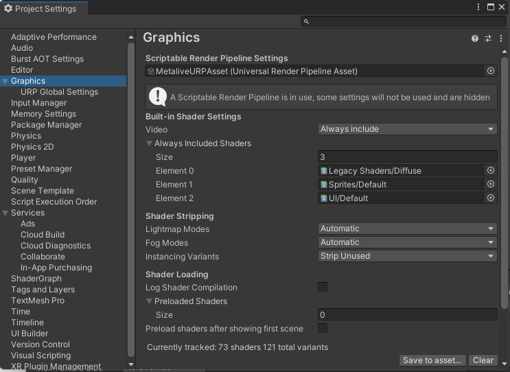
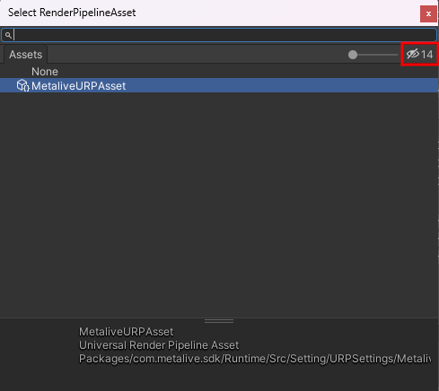
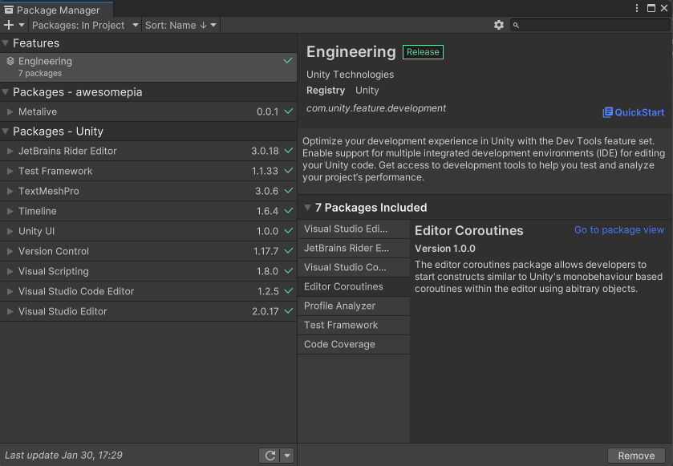
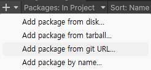
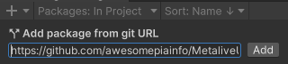

# MetaliveUnitySDK

## Setting URP
1. Open unity `Project Settings` and Select `Graphics`

>

2. Select `Scriptable Render Pipeline Settings`

>

++ If you do not see the settings, please click the Show Hide button. ++

---
## Install Package Url
Path = `https://github.com/awesomepiainfo/MetaliveUnitySDK.git?path=System/Assets/Metalive`

#### How to install package
1. Open unity package Manager `UnityEditor/Window/Package Manager`

>

2. Select `+` and `Add package from git URL...`

>

3. Input text package url path

>
