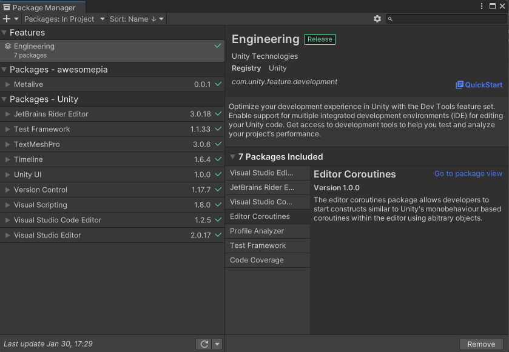
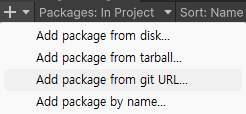
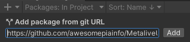

# MetaliveUnitySDK

## Install Package Url
path = `https://github.com/awesomepiainfo/MetaliveUnitySDK.git?path=System/Assets/Metalive`

###### How to install package
1. Open unity package Manager(Unity/Window/PackageManager)

2. Select `+` and `Add package from git URL...`

3. Input text package url path

